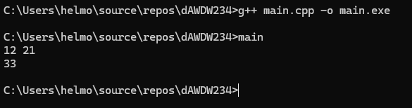
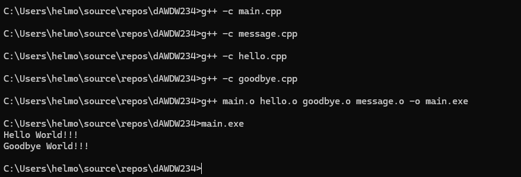
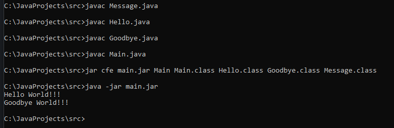
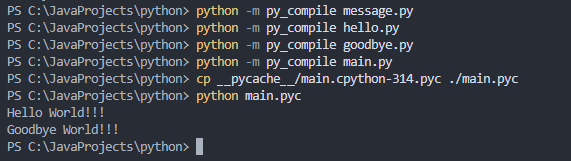
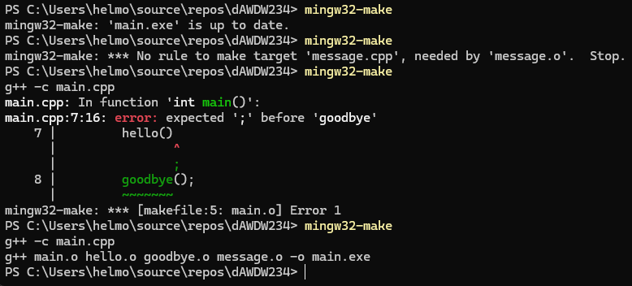
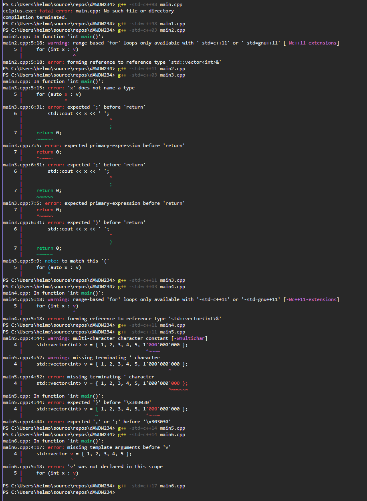

## Лабораторная работа 1

### Задание 1
* **Исходный код** - текст программы на языке программирования
* **Объёктный код** - машинный код полученный после компиляции одного файла
* **Исполняемый код** - финальный машинный код после объединения всех объектных файлов

### Задание 2
* **TAB** - переключение между окнами
* **F5** - копирование файлов в соседнее окно
* **Shift + F4** - создать файл
* **F7** - создать папку

### Задание 3


### Задание 4


### Задание 5


### Задание 6


### Задание 7

makefile перекомпилирует только измененные файлы



### Задание 8


1. std::vector появился в первом стандарте языка
2. Эта конструкция появилась только в C++11
3. auto для автоматической типизации появилось в C++11
4. До C++11 контейнеры приходилось заполнять вручную через push_back()
5. Разделители групп разрядов были добавлены в C++14.
6. Class Template Argument Deduction (CTAD) появился только в C++17

### Задание 9
Без оптимизации (O0):
```
main:
.LFB2239:
	pushq	%rbp
	.seh_pushreg	%rbp
	movq	%rsp, %rbp
	.seh_setframe	%rbp, 0
	subq	$48, %rsp
	.seh_stackalloc	48
	.seh_endprologue
	call	__main
	movl	$0, -4(%rbp)
	leaq	-12(%rbp), %rax
	movq	%rax, %rdx
	movq	.refptr._ZSt3cin(%rip), %rax
	movq	%rax, %rcx
	call	_ZNSirsERi
	movl	$0, -8(%rbp)
	jmp	.L2
```
Здесь явный цикл на 123 итерации (jmp)

----

O1
```
main:
.LFB2263:
	subq	$56, %rsp
	.seh_stackalloc	56
	.seh_endprologue
	call	__main
	leaq	44(%rsp), %rdx
	movq	.refptr._ZSt3cin(%rip), %rcx
	call	_ZNSirsERi
	movl	44(%rsp), %edx
	movl	$123, %eax
	.p2align 3
```

O2
```
main:
.LFB2263:
	subq	$56, %rsp
	.seh_stackalloc	56
	.seh_endprologue
	call	__main
	movq	.refptr._ZSt3cin(%rip), %rcx
	leaq	44(%rsp), %rdx
	call	_ZNSirsERi
	imull	$123, 44(%rsp), %edx
	movq	.refptr._ZSt4cout(%rip), %rcx
	call	_ZNSolsEi
	xorl	%eax, %eax
	addq	$56, %rsp
	ret
	.seh_endproc
	.def	__main;	.scl	2;	.type	32;	.endef
	.ident	"GCC: (MinGW-W64 x86_64-ucrt-posix-seh, built by Brecht Sanders, r3) 14.2.0"
	.def	_ZNSirsERi;	.scl	2;	.type	32;	.endef
	.def	_ZNSolsEi;	.scl	2;	.type	32;	.endef
	.section	.rdata$.refptr._ZSt4cout, "dr"
	.globl	.refptr._ZSt4cout
	.linkonce	discard
```

Здесь цикла уже нет, x просто умножается на 123
